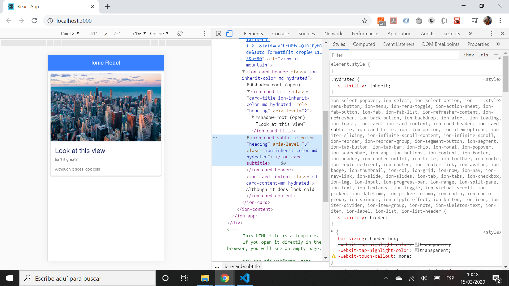

# Ionic React Slides

* App to display an image on a simple Ionic card, using the [Ionic 5 framework](https://ionicframework.com/docs) with [React](https://reactjs.org/)].
* Initially [Paul Halliday: Youtube tutorial](video: Ionic 4 - Angular, React and Vue.js](https://www.youtube.com/watch?v=eQTNqtVeTgE).) code but to be added to.

## Table of contents

* [General info](#general-info)
* [Screenshots](#screenshots)
* [Technologies](#technologies)
* [Setup](#setup)
* [Features](#features)
* [Status](#status)
* [Inspiration](#inspiration)
* [Contact](#contact)

## General info

* App was created using the `npm create-react-app` package then the ionic dependencies were added from npm. 

## Screenshots

## Technologies

* [Ionic v5.0.5](https://ionicframework.com/) framework
* [React v16.13.0](https://reactjs.org/) library
* [create-react-app v3.4.0](https://www.npmjs.com/package/create-react-app) npm module used to create the app

## Setup

* Load dependencies using `npm i`,
* To start the server on _localhost://8100_ type: 'ionic serve'

## Code Examples

* N/A

## Features

* N/A

## Status & To-do list

* Status: working. Very simple Ion-card app
* To-do: add functionality

## Inspiration

* Paul Halliday: Youtube video: Ionic 4 - Angular, React and Vue.js](https://www.youtube.com/watch?v=eQTNqtVeTgE).

## Contact

Repo created by [ABateman](https://www.andrewbateman.org) - feel free to contact me!
